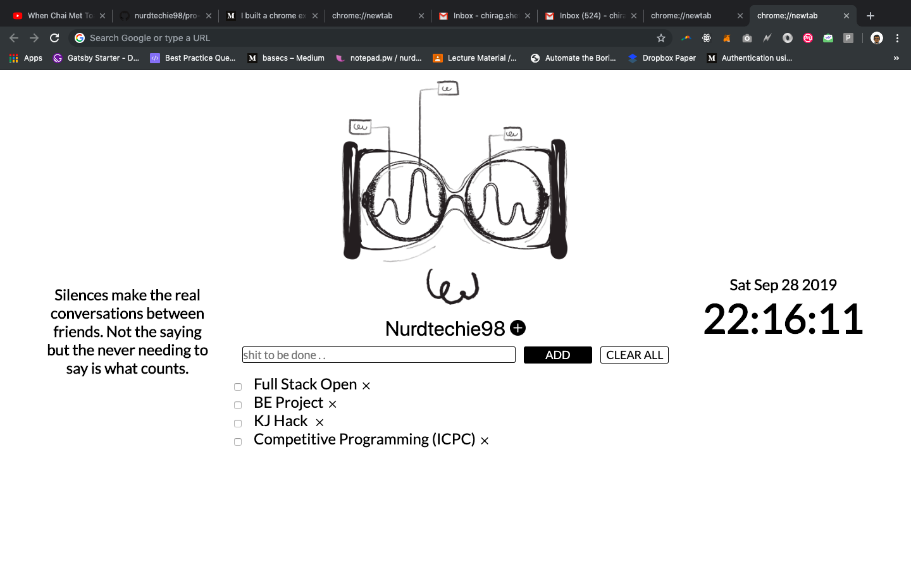

<h1 align="center">Pro ductive</h1>

    

Yet another new tab extension with To-Do list

------------------------------------------

> A minimalist new tab to remind me of tasks I have remaining to be done, when I procarstinate on the web.

    <kbd>
        
    </kbd>

## Features
- [x] time
- [X] quotes
- [X] sync across device
- [ ] visualize time remaining

> will keep making a few additions as an when I find think of some new features.

## Installation
- Download zip file or clone the repository
- Go to [Manage Extension](chrome://extensions/)
- Select Load Unpacked options
- Select the directory where you have this project downloaded 
And you are good to go
